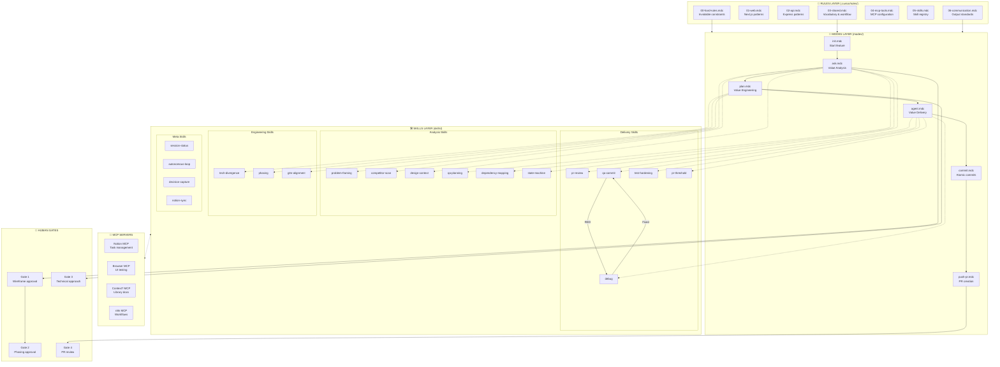

# Cursor Rules Architecture — One-Pager

## Overview

This workspace implements a **structured AI-assisted development workflow** using Cursor's rules system. It enforces a Toyota Production System (TPS)-inspired methodology with three core phases: **Value Analysis → Value Engineering → Value Delivery**.

---

## Architecture Diagram



---

## Layer Breakdown

### 1. Rules Layer (Always Applied)

| File | Purpose | Key Constraints |
|------|---------|-----------------|
| `00-hard-rules.mdc` | Inviolable constraints | No `any`, <200 LOC/component, reuse-first |
| `01-web.mdc` | Next.js 15 patterns | App router, RSC, feature structure |
| `02-api.mdc` | Express.js patterns | 3-layer API, MikroORM entities |
| `03-shared.mdc` | Vocabulary & workflow | Value Analysis/Engineering/Delivery phases |
| `04-mcp-tools.mdc` | MCP server configs | Notion, Browser, Context7, n8n |
| `05-skills.mdc` | Skill registry | Trigger phrases, available skills |
| `06-communication.mdc` | Output standards | BLUF, progressive disclosure, no filler |

### 2. Modes Layer (Workflow States)

```
INIT → ASK → PLAN → AGENT → COMMIT → PUSH-PR
                ↑         ↓
                └─────────┘ (Loop on debug)
```

| Mode | Phase | Purpose | Output |
|------|-------|---------|--------|
| **Init** | Setup | Branch creation, Notion sync | Feature summary |
| **Ask** | Value Analysis | Explore WHAT to build | QA Contract (G#N, AC#N) |
| **Plan** | Value Engineering | Define HOW to build | Commit Plan |
| **Agent** | Value Delivery | Build and verify | Verified code |
| **Commit** | Delivery | Atomic changes | Git commits |
| **Push-PR** | Delivery | Create PR | Pull request |

### 3. Skills Layer (Reusable Capabilities)

Skills are modular, invocable capabilities that modes orchestrate.

#### Invocation Patterns

| Pattern | Example | When |
|---------|---------|------|
| **User trigger** | "use debug skill" | Manual invocation |
| **Mode auto-invoke** | Ask → `qa-planning` | Part of workflow |
| **Skill chaining** | `qa-commit` → `debug` | On RED verdict |
| **Silent invoke** | Skills run without output | During analysis phases |

#### Skill Categories

| Category | Skills | Purpose |
|----------|--------|---------|
| **Analysis** | problem-framing, competitor-scan, design-context, qa-planning, dependency-mapping, state-machine | Explore and define requirements |
| **Engineering** | tech-divergence, phasing, gtm-alignment | Technical decisions and planning |
| **Delivery** | pr-review, qa-commit, debug, test-hardening, pr-threshold | Build and verify |
| **Meta** | session-status, autonomous-loop, decision-capture, notion-sync | Cross-cutting concerns |

### 4. MCP Layer (External Integrations)

| Server | Purpose | Key Tools |
|--------|---------|-----------|
| **Notion** | Task management | `API-retrieve-a-page`, `API-patch-page` |
| **Browser** | UI testing, competitor scan | `browser_navigate`, `browser_snapshot` |
| **Context7** | Library documentation | `resolve-library-id`, `get-library-docs` |
| **n8n** | Workflow automation | `execute_workflow` |

---

## Workflow Example: Feature Development

```
1. User: "init feature from [Notion URL]"
   └── Init Mode reads modes/init.mdc
       ├── Clean git state
       ├── Fetch Notion task
       ├── Create branch
       └── Handoff to Ask Mode

2. User: "explore" or "yes"
   └── Ask Mode reads modes/ask.mdc
       ├── PHASE 1 (DIVERGE)
       │   ├── [Silent] problem-framing skill
       │   ├── [Silent] competitor-scan skill
       │   ├── [Silent] design-context skill
       │   ├── [Output] Executive summary
       │   ├── [Output] Dream wireframes
       │   └── GATE 1: User OK/KO/DIG per wireframe
       │
       └── PHASE 2 (CONVERGE)
           ├── [Silent] state-machine skill
           ├── [Silent] qa-planning skill → QA Contract
           ├── [Silent] dependency-mapping skill
           ├── [Silent] phasing skill
           ├── [Output] Executive summary + Timeline
           └── GATE 2: User approves phasing

3. User: "plan"
   └── Plan Mode reads modes/plan.mdc
       ├── APPETITE: Define constraints
       ├── REUSE INVENTORY: Search existing code
       ├── TECH DIVERGE: tech-divergence skill
       │   └── GATE 3 (if score ≥ 4): User picks approach
       ├── COMMIT PLAN: Define atomic commits
       └── THRESHOLD: Project PR trigger point

4. User: "agent" or starts working
   └── Agent Mode reads modes/agent.mdc
       └── Per Commit:
           ├── Implement changes
           ├── pr-review skill (lint, typecheck)
           ├── qa-commit skill
           │   └── If RED → debug skill (auto-loop)
           └── pr-threshold skill (check if PR needed)

5. User: "push PR" or threshold triggers
   └── Push-PR Mode reads modes/push-pr.mdc
       ├── Prepare PR description
       ├── Create PR via gh CLI
       ├── Update Notion with PR link
       └── GATE 4: Code review
```

---

## Key Concepts

### Progressive Disclosure

| Level | Trigger | Content |
|-------|---------|---------|
| **L1** | Default | Summary table, 3-5 bullets |
| **L2** | "DIG", "explain" | Rationale, trade-offs |
| **L3** | "full detail" | Complete analysis |

### QA Contract

The central artifact linking requirements to implementation:

```
QA Contract = G#1-N (Gherkin scenarios) + AC#1-N (Acceptance criteria)
```

- Generated during Ask Mode (qa-planning skill)
- Referenced in Plan Mode (each commit has "Satisfies: G#X, AC#Y")
- Verified in Agent Mode (qa-commit skill)

### Patine (Decision Wisdom)

Accumulated knowledge of **why** decisions were made:

- Captured at every Gate when user says KO
- Stored in Notion's Decision Patine database
- Prevents re-proposing rejected approaches

### Jidoka (Auto-Escalation)

When something fails:

```
qa-commit RED → auto-invoke debug → fix → re-verify → loop until GREEN
```

After 3 failed attempts → escalate to human.

---

## File Structure

```
.cursor/rules/
├── 00-hard-rules.mdc      # Inviolable constraints
├── 01-web.mdc             # Next.js patterns
├── 02-api.mdc             # Express patterns
├── 03-shared.mdc          # Vocabulary, workflow summary
├── 04-mcp-tools.mdc       # MCP server configs
├── 05-skills.mdc          # Skill registry
├── 06-communication.mdc   # Output standards
│
├── modes/
│   ├── init.mdc           # Start feature
│   ├── ask.mdc            # Value Analysis
│   ├── plan.mdc           # Value Engineering
│   ├── agent.mdc          # Value Delivery
│   ├── commit.mdc         # Atomic commits
│   └── push-pr.mdc        # PR creation
│
└── skills/
    ├── problem-framing/SKILL.md
    ├── competitor-scan/SKILL.md
    ├── qa-planning/SKILL.md
    ├── qa-commit/SKILL.md
    ├── debug/SKILL.md
    └── ... (28 total skills)
```

---

## Quick Reference

| Want to... | Say... | Mode/Skill |
|------------|--------|------------|
| Start a feature | "init [Notion URL]" | Init Mode |
| Explore requirements | "explore", "ask" | Ask Mode |
| Design implementation | "plan" | Plan Mode |
| Start building | "agent" | Agent Mode |
| Debug an issue | "use debug skill" | Debug Skill |
| Create PR | "push PR" | Push-PR Mode |
| Iterate until done | "ralph mode" | Autonomous Loop |
