# Cursor Rules System — Flowcharts

Detailed diagrams showing how rules, modes, skills, and MCP tools interact.

---

## 1. Complete System Overview

```mermaid
flowchart TB
    subgraph USER["👤 USER INPUT"]
        TRIGGER[Trigger keyword<br/>"init", "ask", "plan", etc.]
    end

    subgraph RULES["📜 ALWAYS-APPLIED RULES"]
        HR[Hard Rules]
        SHARED[Shared Vocabulary]
        COMM[Communication Standards]
        MCP_CFG[MCP Configuration]
    end

    subgraph MODE_DISPATCH["🔀 MODE DISPATCHER"]
        DETECT{Detect<br/>trigger}
        READ[Read mode file<br/>from modes/]
    end

    subgraph MODES["🔄 MODE EXECUTION"]
        INIT[Init Mode]
        ASK[Ask Mode]
        PLAN[Plan Mode]
        AGENT[Agent Mode]
        COMMIT_M[Commit Mode]
        PR[Push-PR Mode]
    end

    subgraph SKILLS["🛠️ SKILL INVOCATION"]
        SKILL_READ[Read SKILL.md]
        SKILL_EXEC[Execute phases]
        SKILL_OUT[Return output]
    end

    subgraph MCP["🔌 MCP TOOLS"]
        NOTION[Notion]
        BROWSER[Browser]
        CTX7[Context7]
    end

    subgraph GATES["🚦 GATES"]
        G1[Gate 1]
        G2[Gate 2]
        G3[Gate 3]
        G4[Gate 4]
    end

    USER --> RULES
    RULES --> MODE_DISPATCH
    DETECT --> READ
    READ --> MODES
    
    MODES -.->|invoke skill| SKILLS
    SKILLS -.->|use MCP| MCP
    SKILLS -.->|return| MODES
    
    MODES --> GATES
    GATES -->|OK| MODES
    GATES -->|KO| USER
```

---

## 2. Mode Transition Flow


---

## 3. Ask Mode (Value Analysis) — Detailed


---

## 4. Plan Mode (Value Engineering) — Detailed


---

## 5. Agent Mode (Value Delivery) — Commit Loop


---

## 6. Skill Invocation Pattern

```mermaid
flowchart LR
    subgraph TRIGGERS["Trigger Sources"]
        USER[User: "use X skill"]
        MODE[Mode auto-invoke]
        SKILL[Skill chaining]
    end
    
    subgraph EXECUTION["Skill Execution"]
        READ[Read skills/X/SKILL.md]
        PHASES[Execute phases in order]
        MCP[Use MCP tools if needed]
        OUTPUT[Generate output]
    end
    
    subgraph MODES["Mode Types"]
        SILENT[Silent<br/>No output until complete]
        VISIBLE[Visible<br/>Show intermediate output]
    end
    
    TRIGGERS --> READ
    READ --> PHASES
    PHASES <-.-> MCP
    PHASES --> OUTPUT
    
    OUTPUT --> SILENT
    OUTPUT --> VISIBLE
```

---

## 7. MCP Integration Map


---

## 8. QA Contract Flow


---

## 9. Gate Decision Points

```mermaid
flowchart TB
    subgraph G1["Gate 1: Wireframe Approval"]
        W[Per wireframe]
        W --> OK1[OK: Validated]
        W --> KO1[KO: Rejected]
        W --> DIG1[DIG: Refine]
        KO1 --> DEC1[decision-capture]
    end
    
    subgraph G2["Gate 2: Phasing Approval"]
        P[Proposed timeline]
        P --> OK2[OK: Proceed]
        P --> REORDER[REORDER]
        P --> SPLIT[SPLIT]
        P --> MERGE[MERGE]
        P --> BLOCK[BLOCK]
        BLOCK --> DEC2[decision-capture]
    end
    
    subgraph G3["Gate 3: Technical Approach"]
        T[Score ≥ 4]
        T --> A[Option A]
        T --> B[Option B]
        T --> C[Option C]
        A & B & C --> DEC3[decision-capture<br/>if rejected]
    end
    
    subgraph G4["Gate 4: PR Review"]
        PR[Pull Request]
        PR --> APPROVE[Approve]
        PR --> CHANGES[Request Changes]
        CHANGES --> AGENT[Back to Agent]
    end
    
    G1 -->|All OK| G2
    G2 -->|OK| G3
    G3 -->|Selected| G4
```



---

## 10. Session Tracking (TPS Metrics)


---

## Quick Reference Table

| Diagram | Shows |
|---------|-------|
| 1. System Overview | All layers and connections |
| 2. Mode Transition | State machine of modes |
| 3. Ask Mode | Diverge/Converge phases |
| 4. Plan Mode | 5 engineering phases |
| 5. Agent Mode | Commit loop with debug |
| 6. Skill Invocation | How skills are triggered |
| 7. MCP Integration | Which skills use which MCP |
| 8. QA Contract | Lifecycle of G#N/AC#N |
| 9. Gate Decisions | Human checkpoints |
| 10. Session Tracking | TPS metrics display |
