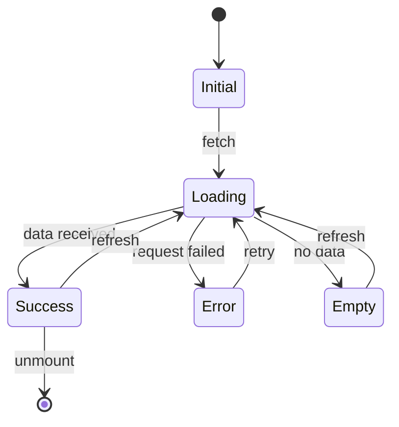

# State Machine Skill

Document the state machine for UI components, comparing current behavior to expected behavior and mapping all state transitions.

## When to Use

- During Ask mode CONVERGE loop for stateful components
- When refactoring existing components with complex state
- Before implementing new interactive UI components

## Instructions

### Phase 1: Identify States

List all possible states for the component:

| State | Current Behavior | Expected Behavior |
|-------|------------------|-------------------|
| Initial | [What happens now] | [What should happen] |
| Loading | [Current loading UX] | [Expected loading UX] |
| Success | [Current success display] | [Expected success display] |
| Error | [Current error handling] | [Expected error handling] |
| Empty | [Current empty state] | [Expected empty state] |

**Common States to Consider:**

| State Type | Examples |
|------------|----------|
| Data states | Initial, Loading, Success, Error, Empty, Stale |
| Interaction states | Idle, Hover, Focus, Active, Disabled |
| Visibility states | Hidden, Visible, Collapsed, Expanded |
| Selection states | Unselected, Selected, Partially selected |
| Validation states | Valid, Invalid, Pending validation |

### Phase 2: Map Transitions

Define what triggers each state change:

| From | To | Trigger | Side Effects |
|------|----|---------|--------------|
| Initial | Loading | User action / Mount | Start fetch |
| Loading | Success | Data received | Populate UI |
| Loading | Error | Request failed | Show error message |
| Loading | Empty | Empty response | Show empty state |
| Error | Loading | Retry clicked | Restart fetch |
| Success | Loading | Refresh clicked | Refetch data |

### Phase 3: State Diagram

Create a Mermaid state diagram:



### Phase 4: Data Requirements

For each state, define what data is needed:

| State | Required Data | UI Elements |
|-------|---------------|-------------|
| Initial | None | Placeholder or skeleton |
| Loading | None | Spinner, skeleton, progress |
| Success | [List required fields] | Full component |
| Error | Error message, retry action | Error banner, retry button |
| Empty | Empty message, CTA | Empty illustration, CTA button |

### Phase 5: Edge Cases

Identify edge cases and how to handle:

| Edge Case | Current | Expected |
|-----------|---------|----------|
| Network timeout | [Current] | Show timeout message, retry option |
| Partial data | [Current] | Graceful degradation, show available |
| Stale data | [Current] | Show stale indicator, background refresh |
| Concurrent updates | [Current] | Optimistic update, rollback on conflict |
| Auth expired | [Current] | Redirect to login, preserve state |

## Output Format

```markdown
## State Machine: [Component Name]

### State Table

| State | Current | Expected | Data Required |
|-------|---------|----------|---------------|
| Initial | [Behavior] | [Behavior] | [Data] |
| Loading | [Behavior] | [Behavior] | [Data] |
| Success | [Behavior] | [Behavior] | [Data] |
| Error | [Behavior] | [Behavior] | [Data] |
| Empty | [Behavior] | [Behavior] | [Data] |

### Transition Diagram

[Mermaid stateDiagram]

### Edge Cases

| Case | Handling |
|------|----------|
| [Case] | [How to handle] |

### Summary
- States: [N] identified
- Transitions: [N] mapped
- Edge cases: [N] documented
```

## Invocation

Invoke manually with "use state-machine skill" or follow Ask mode CONVERGE loop which references this skill.

## Related Skills

- `qa-planning` - Uses states to define test coverage
- `design-context` - Check existing component states in Storybook
